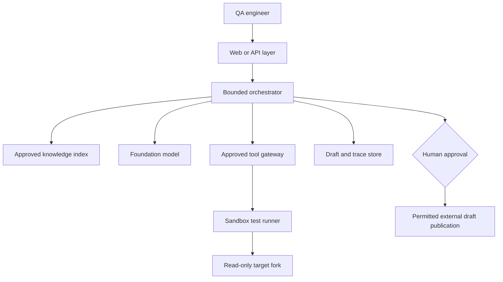

# Initial Architecture and Context Diagram

The Week 1 design uses direct orchestration so that state, permissions, evidence, and stop rules can be inspected and tested independently. Components may change during implementation, but the safety boundaries remain part of the system contract.

## Trust boundaries

- The user reaches the system through the authenticated web or API layer.
- The foundation model has no direct repository, operating-system, or network access.
- Retrieved repository text is treated as untrusted evidence, not executable instruction.
- The approved tool gateway validates every typed tool request against policy and current session state.
- The sandbox runner receives only fixed commands mapped from approved suite identifiers.
- The target repository is read-only from CodeGuard's perspective.
- The trace store redacts sensitive values and records sources, calls, results, approvals, and stop reasons.
- Publication is separate from draft generation and requires an authenticated approval event.

## Component responsibilities

| Component                | Responsibility                                                                                                               |
| ------------------------ | ---------------------------------------------------------------------------------------------------------------------------- |
| Web/API layer            | Authenticates the user, validates request fields, selects an approved target, and displays evidence and approval controls.   |
| Bounded orchestrator     | Maintains session state and performs sense/context → decide → act/tool → observe → stop/re-plan within fixed limits. |
| Foundation model         | Produces structured plans, interprets evidence, and drafts explanations; it has no direct system access.                     |
| Approved knowledge index | Stores authorised document chunks with source, version, and location metadata.                                               |
| Approved tool gateway    | Validates schemas, permissions, targets, suite aliases, and call limits before invoking a tool.                              |
| Sandbox test runner      | Executes only configured commands and returns exact machine evidence.                                                        |
| Read-only target fork    | Provides the approved application source, documentation, and test suite at a pinned revision.                                |
| Draft and trace store    | Retains internal drafts, citations, tool interactions, approvals, and stop reasons according to access and retention rules.  |

## Primary data flow

1. Validate the identity, target repository, branch, feature, and session limits.
2. Retrieve approved requirement evidence and provide it as model context.
3. Generate a structured test plan and obtain human review.
4. Request only an approved tool using its typed schema.
5. Execute the fixed test suite in the sandbox and return exact evidence.
6. Explain the result, store the trace, and request approval before any permitted external publication.

## Initial tool contracts

| Tool                     | Inputs                                        | Outputs                                                            | Permission and side effect                    |
| ------------------------ | --------------------------------------------- | ------------------------------------------------------------------ | --------------------------------------------- |
| Search project knowledge | `repo_id`, `query`, `filters`                 | Ranked passages with source/version/location                       | Read-only; approved corpus only.              |
| Run approved test        | `repo_id`, `revision`, `suite_id`             | Status, resolved alias, exit code, timing, and artefact references | Sandboxed; allow-listed suite; strict limits. |
| Get test result          | `trace_id`, `run_id`                          | Structured test cases, log references, and artefact references     | Read-only; permission checked.                |
| Save draft report        | `trace_id`, `report_type`, structured content | Draft ID, version, and timestamp                                   | Internal draft only; no external publication. |
