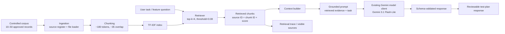

# Week 3 RAG Architecture

## Data flow

1. `knowledge/source-register.json` records provenance and the approved corpus paths.
2. `load_corpus()` reads Markdown/text records and creates line-aware overlapping chunks.
3. `TfidfIndex` builds a local, deterministic lexical index suitable for the small controlled corpus.
4. `RAGPipeline.retrieve()` ranks chunks using cosine similarity and keeps up to four above the minimum threshold.
5. `build_grounded_context()` exposes source ID, chunk ID, file, line range, score, and evidence text.
6. The augmented prompt instructs the existing Week 2 model layer to use only retrieved evidence for project-specific factual claims.
7. When evidence is absent or incomplete, the expected behavior is clarification rather than invention.

## Boundary

Week 3 adds retrieval and grounding only. Repository inspection, arbitrary shell execution, autonomous merge/deployment, memory, and unrestricted tools remain outside this week's scope.
