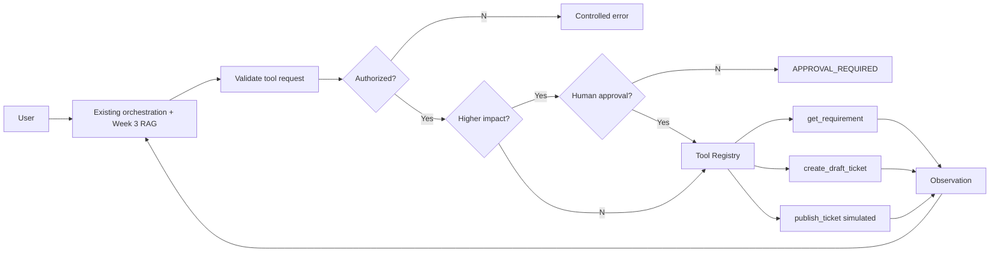

# Week 4 Tools Architecture

```mermaid
flowchart LR
U[User]-->O[Existing orchestration + Week 3 RAG]
O-->V[Validate tool request]
V-->A{Authorized?}
A--No-->E[Controlled error]
A--Yes-->H{Higher impact?}
H--Yes-->P{Human approval?}
P--No-->R[APPROVAL_REQUIRED]
P--Yes-->X[Tool Registry]
H--No-->X
X-->T1[get_requirement]
X-->T2[create_draft_ticket]
X-->T3[publish_ticket simulated]
T1-->OBS[Observation]
T2-->OBS
T3-->OBS
OBS-->O
```
Deterministic software owns validation, authorization, approval and execution.
